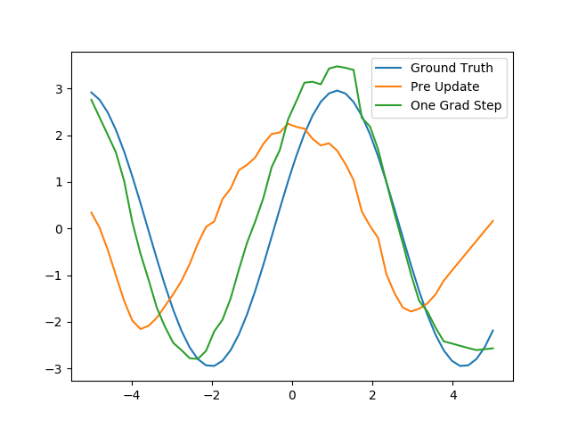
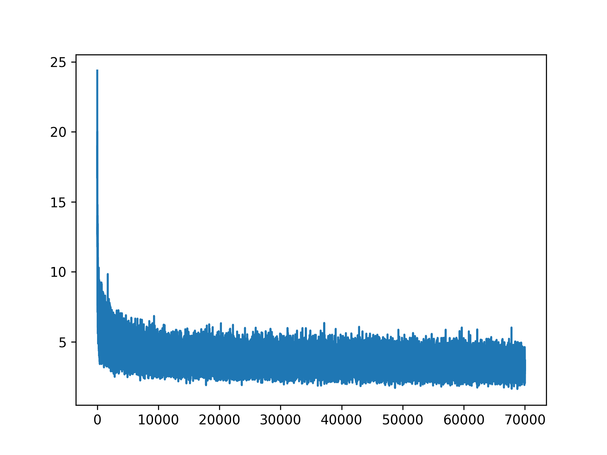

# Model-Agnostic Meta-Learning: Pytorch Implementation
An Pytorch Implementation of the __"Model-Agnostic Meta-Learning for Fast Adaptation of Deep Networks(ICML'17)"__ (a.k.a MAML)

Model-Agnostic means model-independent. This meta-learning algorithm can applied to any model trained with gradient descent, including classification, regression, and reinforcement learning. A good machine learning model often requires training with a large number of samples. Humans, in contrast, learn new concepts and skills much faster and more efficiently. Kids who have seen cats and birds only a few times can quickly tell them apart. People who know how to ride a bike are likely to discover the way to ride a motorcycle fast with little or even no demonstration. Is it possible to design a machine learning model with similar properties — learning new concepts and skills fast with a few training examples? That’s essentially what meta-learning aims to solve.

In this repo, I train a neural network for 7k iterations on a dataset of sine function input/outputs with randomly sampled amplitude and phase, and then fine-tune on 10samples from a fixed amplitude and phase. Only 1-step adaptation shows that MAML is able to fit the sinusoid much more effectively. 
## Pseudocode


## Results
### K=10

pre loss: 15.244 | post loss: 5.391 

### Loss graph


## To train
`python3 main.py`

## To test
`python3 main.py --test`

## Code Explanation
* net.py
```python
class Net(nn.Module):
    def __init__(self):
        super(Net, self).__init__()
        self.w_1 = nn.Parameter(torch.DoubleTensor(40, 1))
        self.b_1 = nn.Parameter(torch.DoubleTensor(40))
        self.w_2 = nn.Parameter(torch.DoubleTensor(40, 40))
        self.b_2 = nn.Parameter(torch.DoubleTensor(40))
        self.w_3 = nn.Parameter(torch.DoubleTensor(1, 40))
        self.b_3 = nn.Parameter(torch.DoubleTensor(1))
        self.reset_parameters()
        self.Param = OrderedDict()
        self.set_Param()

        self.mse = nn.MSELoss(reduction='sum')
```
This class is MLP(one hidden layer) to predict sinusoid function. I made this NN by declaring each parameters. 
* meta.py
```python
class Meta(nn.Module):
    def __init__(self, inner_lr=1e-2, outer_lr=1e-3):
        super(Meta, self).__init__()
        self.inner_lr = inner_lr
        self.outer_lr = outer_lr
        self.net = Net()
        self.outer_optim = optim.Adam(list(self.net.Param.values()), lr=self.outer_lr)
        # print(list(self.net.Param.values()))

    def forward(self, k_x, k_y, q_x, q_y):
        batch_size = k_x.size(0)
        losses = None
        for i in range(batch_size):
            lossA, predA = self.net(k_x[i], k_y[i])
            # print(lossA)
            grad = torch.autograd.grad(lossA, self.net.Param.values(), create_graph=True, retain_graph=True)
            fast_weights = OrderedDict(
                (name, p - self.inner_lr * g) for ((name, p), g) in zip(self.net.Param.items(), grad))
            # print(fast_weights)

            lossB, predB = self.net(q_x[i], q_y[i], fast_weights)

            if losses is None:
                losses = lossB
            else:
                losses = losses + lossB

        self.outer_optim.zero_grad()
        losses.backward()
        self.outer_optim.step()
        self.net.set_Param()

        return losses.item() / batch_size
```
This class is needed to meta-learn. In forward function, this class calculate gradients w.r.t inner loop, and use these gradients to make fast_weights. fast_weights is used in outer loop. In outer loop, optimizer steps and backprop. This sequence is meta-learning. Inner loop uses just SGD(lr=1e-2) and outer loop uses Adam optimizer(lr=1e-3).

* main.py
```python
def main(args):
    device = torch.device('cuda' if torch.cuda.is_available() else 'cpu')
    print(device)
    meta = Meta(inner_lr=args.inner_lr, outer_lr=args.outer_lr)
    meta.to(device)
    if not args.test:
        train_ds = Sinusoid(k_shot=args.k_shot, q_query=15, num_tasks=1000000)
        train_dl = DataLoader(train_ds, batch_size=args.batch_size, shuffle=True, pin_memory=True)

        best_loss = float('inf')
        losses = []
        pbar = tqdm(range(args.epochs))
        for epoch in pbar:
            k_i, k_o, q_i, q_o = next(iter(train_dl))
            k_i, k_o, q_i, q_o = k_i.to(device), k_o.to(device), q_i.to(device), q_o.to(device)
            loss = meta(k_i, k_o, q_i, q_o)
            losses.append(loss)
            pbar.set_description('| loss: {:.5f} |'.format(loss))

            if best_loss > loss:
                best_loss = loss
                meta.save_weights()
```
In main.py, I set k=10, q=15. i.e. Model sees only 10 sinusoid functions and predict phase and amplitude of unseen sinusoid function(A*sin(x+theta)). Resulting graph shows that a model can learn underlying concepts of sinusoid function with only few-shot.  
## Reference
[Model-Agnostic Meta-Learning](https://arxiv.org/pdf/1703.03400.pdf)
